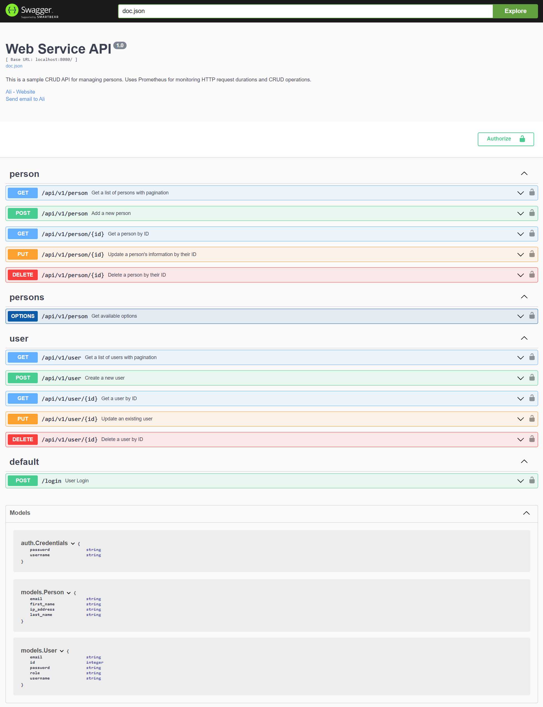
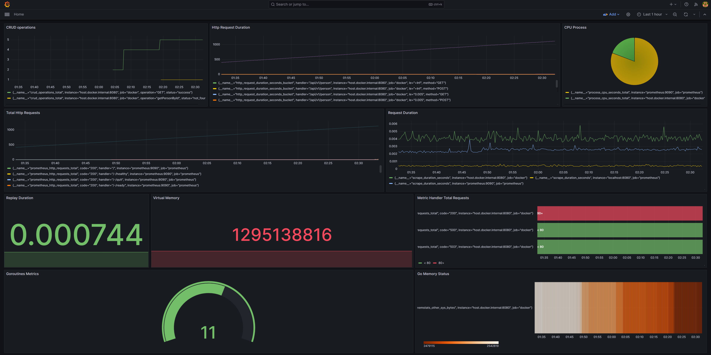
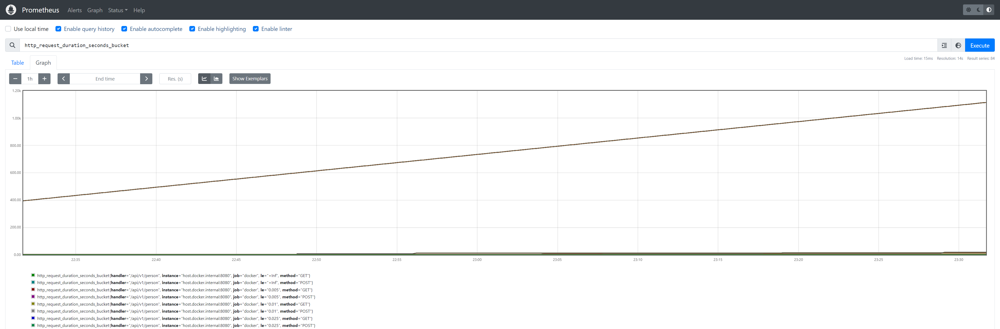
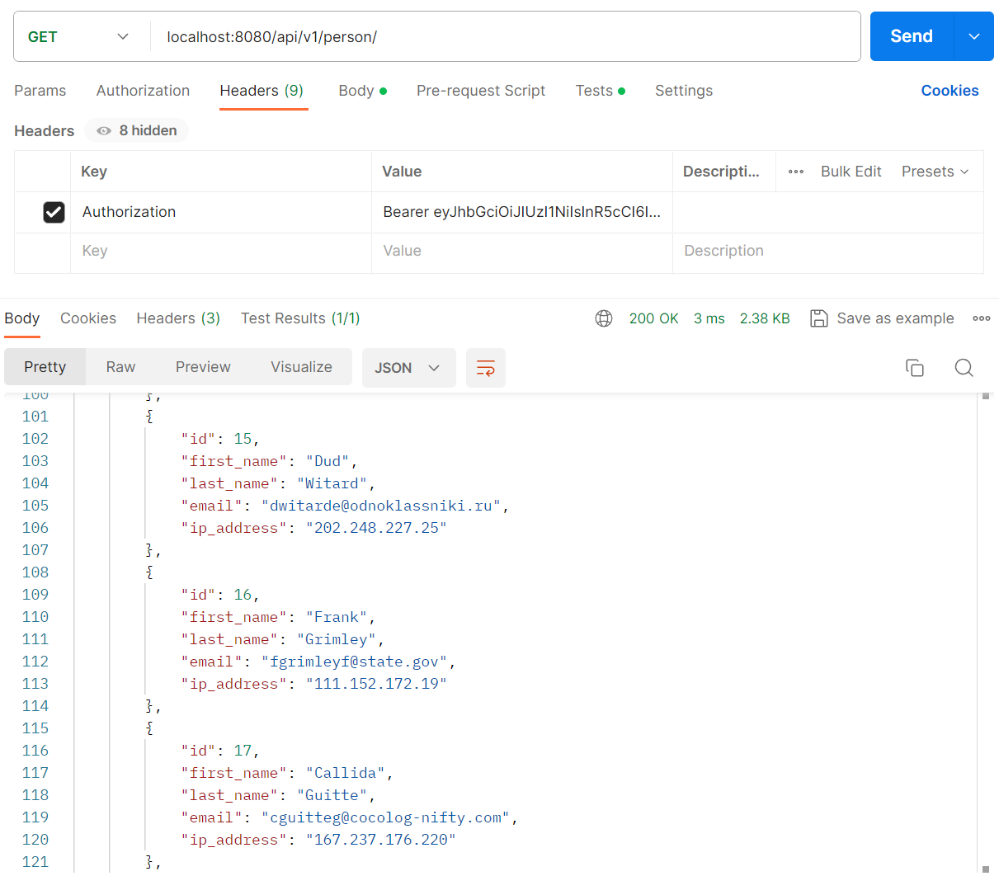

# Go Web Service

A quick overview of this project: This project aims to develop a performant web service using Go/Gin, facilitating basic CRUD operations for user and person models. The service focuses on efficiently handling incoming HTTP requests with concurrent data processing, ensuring effective data storage in a SQLite database. It implements metric measurements using Prometheus for monitoring various aspects of the service's performance. Additionally, Grafana is employed for visualizing these metrics, offering insights into the service's behavior. The API is documented and managed using Swagger, providing a clear and concise interface for users.

# Getting Started

- git clone https://github.com/FakirHerif/Go-Web-Service.git
- cd "your project directory"
- docker build . -t webservice
- docker compose up

**For Swagger:**
```
http://localhost:8080/docs/index.html
```

**For Prometheus:**
```
http://localhost:9090/
```

**For Grafana:**
```
http://localhost:3000/

username: admin
password: admin
```

**For Tests in Local:**
- cd "your project directory"/models
    - go test -v

# Live Preview For API

This live preview provides an interactive interface to explore and interact with the API endpoints implementing CRUD (Create, Read, Update, Delete, Options) operations. Navigate through the available endpoints, execute requests, and observe the API's behavior in real-time with Swagger.

[Explore by clicking here.](https://goproject.fly.dev/docs/index.html#) 

To obtain a token, enter the login credentials with
```
{
  "password": "admin",
  "username": "admin"
}
```
After obtaining the token, click on the Authorize button. Type 'Bearer' in the Value field, and then input the token.

# Utilized Technologies in Project Development

In this project, a variety of technologies have been employed to ensure robust functionality, effective monitoring, and seamless development and deployment:

- **Go:** The programming language used for building the core application logic.
    - **Gin:** A web framework used to handle HTTP requests and facilitate routing within the application.
    - **gin-contrib/cors:** Middleware for handling Cross-Origin Resource Sharing (CORS) in the Gin framework.
    - **swaggo/swag:** A Go module used for generating API documentation in Swagger format.
    - **net/http:** The standard Go package used for HTTP request handling.
    - **modernc org/sqlite:** A Go package for interacting with SQLite databases, employed for efficient data storage.
    - **dgrijalva/jwt-go:** A Go implementation for JSON Web Tokens (JWT), used for authentication and authorization.
    - **client_golang/prometheus:** A Go client library for Prometheus, enabling metric measurements and monitoring within the application.
- **Prometheus:** An open-source monitoring and alerting toolkit used for collecting and displaying various system metrics.
- **Grafana:** A powerful visualization tool integrated with Prometheus for creating and sharing dashboards based on collected metrics.
- **Swagger:** A set of tools for designing, building, and documenting APIs.
- **Docker:** A containerization platform used to encapsulate the application and its dependencies, ensuring consistent and portable deployment across environments.


# Endpoints

Each operation yields a response (200, 400, 401, 500). For instance, requests made without a token will result in an error(401). Additionally, due to authorization, successful responses for PUT and DELETE operations can only be received by users with the 'admin' role.

**Headers (For All Enpoints):**

```
Key: Authorization      Value: Bearer TOKEN NUMBER
```

**Params (Pagination ===> GET Person and Get User):**

```
Key: pageSize           Value: 20   (Default)
Key: page               Value: 1    (Default)
```

- **Login**
```
POST        /login

Body:

{
    "username": "admin",
    "password": "admin"
}
```

- **Person**
```
GET         /api/v1/person
GET         /api/v1/person/:id
POST        /api/v1/person/
PUT         /api/v1/person/:id
DELETE      /api/v1/person/:id
OPTIONS     /api/v1/person/
```

- **User**
```
GET         /api/v1/user
GET         /api/v1/user/:id
POST        /api/v1/user/
PUT         /api/v1/user/:id
DELETE      /api/v1/user/:id
```

- **Metrics**
```
GET         :8080/metrics
GET         :9090/metrics
```

- **Test For Auth**
```
GET         /secured
```

# Project Note

This project is not a professional-grade work. Therefore, it lacks some functionalities and might contain errors. Feel free to reach out to me  for contributions. 😊

# Some ss from the Project



------------------------------------------------------------------------



------------------------------------------------------------------------



------------------------------------------------------------------------



------------------------------------------------------------------------